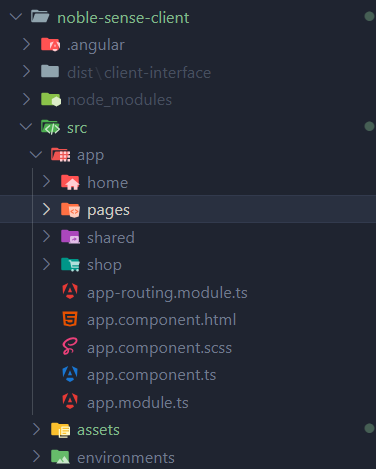
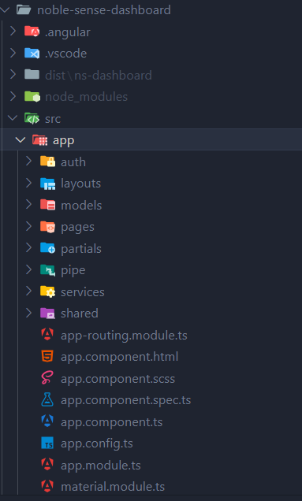
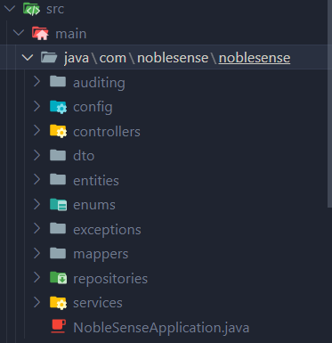

# NobleSense - Ecommerce Platform

NobleSense is a complete ecommerce solution designed to help students and developers learn full-stack development with Angular, Spring Boot, and MySQL. This project serves as an educational resource for end-of-study internships and practical web development training.

## Features

- **Multi-role System** (Admin, Customer)
- **Product Catalog** with categories and filters
- **Shopping Cart** and checkout process
- **Order Management** system
- **User Authentication** with Spring Security
- **Responsive Design** for all devices
- **Admin Dashboard** for content management

## Technology Stack

### Frontend
- **Admin Dashboard**: Angular 15+, Angular Material, SCSS
- **Client Interface**: Angular 15+, Bootstrap, SCSS

### Backend
- **API Server**: Spring Boot 3.x, Spring Security, JWT
- **Database**: MySQL 8.x
- **ORM**: Spring Data JPA, Hibernate

### Development Tools
- **IDE**: Visual Studio Code, IntelliJ IDEA
- **Database Client**: SQL Workbench
- **Build Tools**: Maven, npm

## Architecture Overview

### 1. Client-Side Architecture
  
*Frontend structure and component flow*

### 2. Admin Dashboard Architecture 
  
*Admin panel structure and modules*

### 3. Backend Architecture
  
*API service structure and database interaction*

### Backend (Spring Boot)